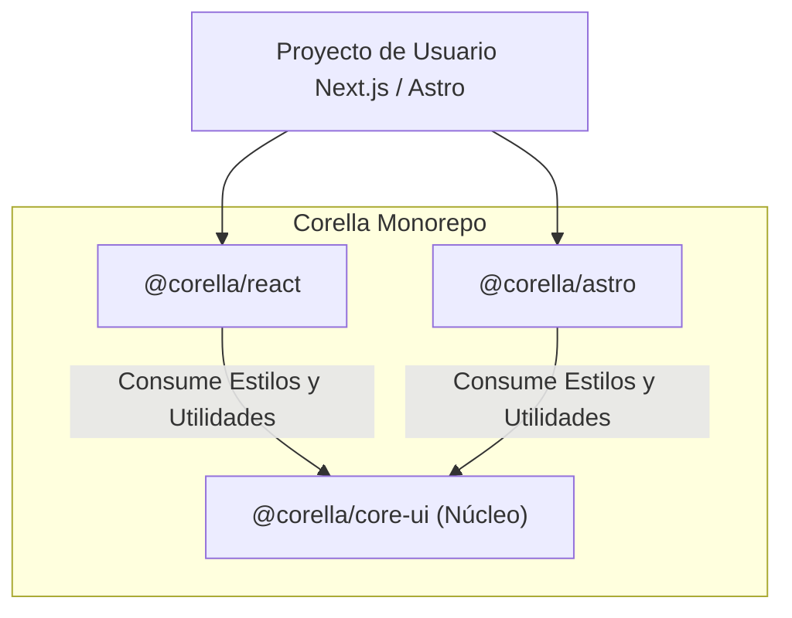

# Corella Design System


**Corella** es un sistema de diseño modular, ligero y agnóstico de framework, construido sobre una arquitectura de monorepo moderna. Su objetivo es proporcionar una interfaz de usuario consistente y de alta calidad a través de múltiples tecnologías (React, Astro) compartiendo un único núcleo de verdad para estilos y lógica.

---

## � Tabla de Contenidos

- [¿Qué es Corella?](#-qué-es-corella)
- [Arquitectura "Core Pattern"](#-arquitectura-core-pattern)
- [Tecnologías](#-tecnologías)
- [Estructura del Monorepo](#-estructura-del-monorepo)
- [Guía de Instalación](#-guía-de-instalación)
- [Configuración del Proyecto](#-configuración-del-proyecto)
- [Personalización de Colores](#-personalización-de-colores)
- [Paquetes Disponibles](#-paquetes-disponibles)
- [Contribución](#-contribución)

---

## 🌟 ¿Qué es Corella?

Corella no es solo una librería de componentes; es una metodología de distribución de UI. A diferencia de las librerías tradicionales que a menudo duplican la lógica de estilos para cada framework, Corella centraliza toda la identidad visual (tokens, clases, lógica de variantes) en un paquete núcleo puro (`@corella/core-ui`).

Los paquetes de framework (`@corella/react`, `@corella/astro`) actúan como **wrappers ligeros** que consumen este núcleo y lo adaptan a la idiosincrasia de cada tecnología (Hooks para React, Props/Slots para Astro).

### Filosofía de Diseño
- **Agnosticismo Primero:** Los estilos no dependen de React ni de Astro.
- **Atomicidad:** Componentes pequeños y componibles.
- **Themeable:** Tokens de diseño basados en CSS Variables nativas.
- **Performance:** Tree-shaking agresivo y cero runtime CSS-in-JS.

---

## 🏗️ Arquitectura "Core Pattern"

El patrón de arquitectura de Corella asegura que cualquier cambio visual se propague instantáneamente a todos los frameworks soportados.



### Flujo de Datos
1.  **Definición:** Los tokens (colores, espacios) y las clases de variantes (styles creators) se definen en `core-ui`.
2.  **Consumo:** Los paquetes `react` y `astro` importan estas funciones creadoras (ej. `getButtonClasses`).
3.  **Renderizado:** Cada framework renderiza el HTML nativo aplicando las clases generadas por el núcleo.

---

## 🛠️ Tecnologías

Corella está construido sobre un stack moderno enfocado en rendimiento y DX (Developer Experience):

-   **Lenguaje:** [TypeScript](https://www.typescriptlang.org/) (Tipado estricto en todo el monorepo).
-   **Estilos:** [Tailwind CSS](https://tailwindcss.com/) (Motor de estilos atómicos).
-   **Gestión de Paquetes:** [pnpm](https://pnpm.io/) (Workspaces eficientes).
-   **Orquestación:** [Turborepo](https://turbo.build/) (Caché de builds y ejecución paralela).
-   **Documentación:** Storybook & Playground interno.

---

## 📂 Estructura del Monorepo

```bash
corella/
├── packages/
│   ├── core-ui/          # 🧠 EL CEREBRO: Estilos base, utilidades y tokens.
│   │   ├── src/styles/   # Definiciones de clases y variables CSS.
│   │   └── package.json
│   │
│   ├── react/            # ⚛️ ADAPTADOR REACT: Componentes funcionales.
│   │   ├── src/          # Implementación de componentes (Button.tsx, etc).
│   │   └── package.json
│   │
│   └── astro/            # 🚀 ADAPTADOR ASTRO: Componentes de servidor.
│       ├── src/          # Implementación (.astro).
│       └── package.json
│
├── playground/           # 📖 DEMO: Documentación viva y Storybook.
├── package.json          # Configuración raíz.
└── turbo.json            # Pipeline de construcción.
```

---

## 🚀 Guía de Instalación

Para utilizar Corella en tu proyecto externo, debes instalar los paquetes necesarios según tu framework.

### Pre-requisitos
Asegúrate de tener configurado **Tailwind CSS** en tu proyecto, ya que Corella utiliza clases de utilidad que deben ser procesadas/reconocidas o bien importar nuestros estilos pre-procesados.

### Instalación de Paquetes

#### Para proyectos React (Next.js, Vite, CRA)
```bash
npm install @corella/react @corella/core-ui
# o
pnpm add @corella/react @corella/core-ui
```

#### Para proyectos Astro
```bash
npm install @corella/astro @corella/core-ui
# o
pnpm add @corella/astro @corella/core-ui
```

---

## ⚙️ Configuración del Proyecto

Para que los estilos de Corella se apliquen correctamente, necesitas integrar la configuración de Tailwind y los estilos base.

### 1. Configurar Tailwind CSS (`tailwind.config.mjs`)
Debes decirle a Tailwind que escanee los archivos dentro de `node_modules/@corella` para generar el CSS necesario.

```javascript
/** @type {import('tailwindcss').Config} */
export default {
  content: [
    './src/**/*.{astro,html,js,jsx,md,mdx,svelte,ts,tsx,vue}',
    // 👇 Agrega esta línea para incluir los componentes de Corella
    './node_modules/@corella/**/*.{js,ts,jsx,tsx,astro}'
  ],
  theme: {
    extend: {
      colors: {
        // Puedes extender los colores de Corella aquí si es necesario
      }
    },
  },
  plugins: [],
}
```

### 2. Importar Estilos y Personalizar Colores

Importa el CSS base de Corella en tu archivo CSS principal o en el punto de entrada de tu aplicación.

```css
/* En tu archivo CSS global (ej. globals.css) */
@import '@corella/core-ui/styles.css';

/* 🎨 PERSONALIZACIÓN (THEMING)
   Corella usa variables CSS nativas.
   Puedes sobrescribirlas en :root para cambiar el tema globalmente.
*/
:root {
  /* Marca Principal (Primary) - Ej. Azul Brand */
  --corella-color-primary: #3b82f6;
  --corella-color-primary-content: #ffffff; /* Texto sobre primary */
  --corella-color-primary-hover: #2563eb;

  /* Superficies (Base) */
  --corella-color-base-100: #ffffff;      /* Fondo de tarjetas/paneles */
  --corella-color-base-200: #f3f4f6;      /* Fondo general */
  --corella-color-base-content: #1f2937;  /* Texto principal */

  /* Bordes y Neutros */
  --corella-color-neutral: #9ca3af;
}

/* Modo Oscuro (Opcional) */
@media (prefers-color-scheme: dark) {
  :root {
    --corella-color-base-100: #1f2937;
    --corella-color-base-200: #111827;
    --corella-color-base-content: #f9fafb;
    --corella-color-primary: #60a5fa; /* Un tono más claro para dark mode */
  }
}
```

Esto habilitará las **CSS Variables** (`--corella-color-primary`, etc.) que dan vida al sistema de diseño.

---

## 📦 Paquetes Disponibles

| Paquete | Versión | Descripción |
| :--- | :---: | :--- |
| **[`@corella/core-ui`](./packages/core-ui)** | `0.0.2` | Utilidades de estilo, tokens y lógica base. |
| **[`@corella/react`](./packages/react)** | `0.0.2` | Componentes listos para usar en React. |
| **[`@corella/astro`](./packages/astro)** | `0.0.2` | Componentes optimizados para Astro. |

### Componentes Implementados
Hasta la fecha, Corella incluye soporte para:
- **Button**: Botones con variantes (solid, outline, ghost), tamaños y colores.
- **Input**: Entradas de texto con soporte de iconos, etiquetas flotantes y estados.
- **Checkbox**: Selección múltiple con variantes clásica, tarjeta y chip.
- **Radio**: Selección única con variantes tarjeta y chip.
- **FilterChip**: Elementos de filtrado interactivos.

---

## 🤝 Contribución

¡Bienvenido al equipo! Para desarrollar en Corella:

1.  **Clona el repo:**
    ```bash
    git clone https://github.com/Agercho/corella.git
    ```
2.  **Instala dependencias (pnpm es obligatorio):**
    ```bash
    pnpm install
    ```
3.  **Inicia el entorno de desarrollo:**
    ```bash
    pnpm dev
    ```
    Esto iniciará el modo *watch* para los paquetes y Storybook para visualización.

### Flujo de Trabajo
1.  Crea la lógica de estilos en `packages/core-ui`.
2.  Implementa el componente en `packages/react`.
3.  Implementa el componente en `packages/astro`.
4.  Crea/Actualiza las historias en `playground/stories`.
5.  Asegúrate de que todo compile con `pnpm build`.

---

2024 © Corella Design System. MIT License.
